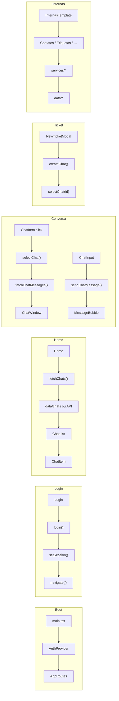

# Upmobb Chat

Frontend em **React + TypeScript** com **Vite**.

## Como rodar

```bash
npm install
npm run dev
```

> No PowerShell, se der erro de política de execução, use: `npm.cmd run dev`

## Estrutura

```
src/
  pages/         → páginas (Login, Home…)
  routes/        → rotas / menu do app
  templates/     → layouts (Home e Internas)
  componentes/   → componentes reutilizáveis
  context/       → estado global (auth, modais…)
  services/      → chamadas de API (não expor lógica sensível no front)
  styles/        → CSS global
  utils/         → funções auxiliares
```

## Padrão de arquivo

Cada pedaço fica na própria pasta, com responsabilidades separadas:

```
componentes/card/
  Card.tsx   → visual / JSX
  Card.css   → estilo
  Card.ts    → tipos e lógica
```

O mesmo vale para pages e templates.

## Templates

- **HomeTemplate** → layout da home
- **InternasTemplate** → layout das páginas internas

## Rotas atuais

| Rota     | Página |
|----------|--------|
| `/`      | Home   |
| `/login` | Login  |

## Mapa do sistema

Fluxos principais (UI → service → dados). Versão interativa: página **Componentes**.



| Fluxo | Caminho resumido |
|-------|------------------|
| Boot | `main` → Auth → rotas |
| Login | Login → `login()` → sessão → Home |
| Lista | Home → `fetchChats()` → mock/API → ChatList |
| Abrir | ChatItem → `selectChat()` → mensagens → ChatWindow |
| Enviar | ChatInput → `sendChatMessage()` → MessageBubble |
| Ticket | NewTicketModal → `createChat()` → abre conversa |
| Internas | página → `services/*` → `data/*` (mock até ter API) |
